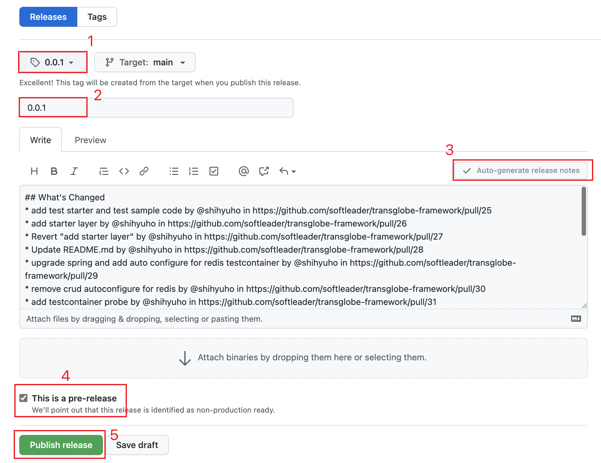

# TransGlobe Framework

A Kubernetes Native Java stack tailored for TransGlobe standards.

```sh
# 顯示所有指令及說明
make help
```

## Developer's Guild

<details>
<summary><b>Environmental Requirement</b></summary><br>

開發前你必須先準備以下環境:

- JDK 11 installed with `JAVA_HOME` configured appropriately
- Apache Maven 3.6.3+

</details>

## Operator's Guild

<details>
<summary><b>Release new version</b></summary><br>

到 [Release](https://github.com/softleader/transglobe-framework/releases) 頁面, 點選 `[Create a new release]` 按鈕



1. 建立 Tag, 版號須符合 [Semantic Versioning 2](https://semver.org/) 規則
2. 輸入 Title, 建議跟 Tag 一樣就好
3. 點選 `[Auto-generate release notes]`
4. 勾選 `This is pre-release`
5. 點選 `[Publish release]`

一旦有任何 pre-release 發佈, 在 [Action](https://github.com/softleader/transglobe-framework/actions) 就會自動 Workflow, 
該 Workflow 會通知公司 [Jenkins](https://softleader.com.tw:48080/view/transglobe/job/transglobe-framework-release/) 執行 [`Jenkinsfile-release`](./Jenkinsfile-release) 中所定義的 pipeline

> 請注意, Workflow timeout 設定為 10 分鐘, 畢竟理論上一個健康的 Release 流程也不會超過 10 分鐘

Pipeline 流程若順利完成, 會發佈 PR 並自動 Merge 回 Main, 當你發現 Main 已經更新了, 便可以到  [Release](https://github.com/softleader/transglobe-framework/releases) 中將 `pre-release` ㄉ勾取消使其成為正式的 Release 版本

</details>
